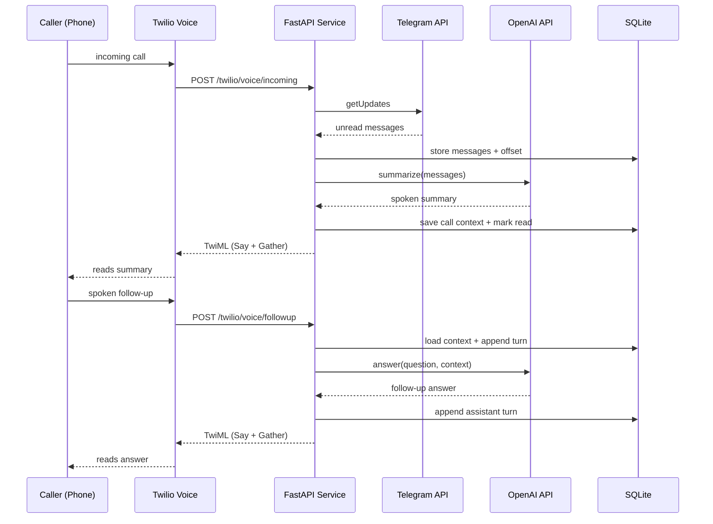

# Architekturuebersicht

## Komponenten

- API Layer: FastAPI in `src/ai_messenger_voicemail/app.py`
- Integrationen:
  - Telegram Bot API: `TelegramService`
  - OpenAI Responses API: `LLMService`
  - Twilio Voice/TwiML: `VoiceService`
- Persistenz:
  - SQLite State Store (`SqliteStore`)
  - Tabellen: `state`, `messages`, `call_contexts`

## Sequenzdiagramm

## Sicherheitsaspekte im Prototyp

- Optionale Twilio-Signaturpruefung (`TWILIO_VALIDATE_SIGNATURE=true`)
- Keine Secrets im Code; alles ueber Environment
- Kein ungefilterter Zugriff auf Telegram bei gesetztem `TELEGRAM_ALLOWED_CHAT_ID`

## Betriebsaspekte

- `GET /healthz` fuer Liveness
- `GET /readyz` prueft DB-Zugriff
- K8s-Probes sind entsprechend konfiguriert
